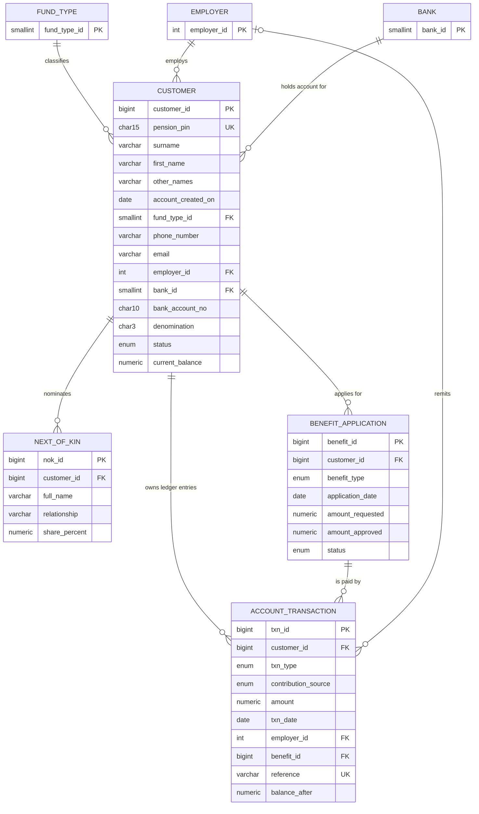

# Entity Relationship Diagram

Image version: [`access_pensions_er.png`](access_pensions_er.png) (generated from `access_pensions_er.dot` with Graphviz).

```mermaid
erDiagram
    FUND_TYPE ||--o{ CUSTOMER : "classifies"
    EMPLOYER  ||--o{ CUSTOMER : "employs"
    BANK      ||--o{ CUSTOMER : "holds account for"
    CUSTOMER  ||--o{ NEXT_OF_KIN : "nominates"
    CUSTOMER  ||--o{ ACCOUNT_TRANSACTION : "owns ledger entries"
    CUSTOMER  ||--o{ BENEFIT_APPLICATION : "applies for"
    BENEFIT_APPLICATION ||--o{ ACCOUNT_TRANSACTION : "is paid by"
    EMPLOYER  |o--o{ ACCOUNT_TRANSACTION : "remits"

    CUSTOMER {
        bigint customer_id PK
        char15 pension_pin UK
        varchar surname
        varchar first_name
        varchar other_names
        date account_created_on
        smallint fund_type_id FK
        varchar phone_number
        varchar email
        int employer_id FK
        smallint bank_id FK
        char10 bank_account_no
        char3 denomination
        enum status
        numeric current_balance
    }
    ACCOUNT_TRANSACTION {
        bigint txn_id PK
        bigint customer_id FK
        enum txn_type
        enum contribution_source
        numeric amount
        date txn_date
        int employer_id FK
        bigint benefit_id FK
        varchar reference UK
        numeric balance_after
    }
    BENEFIT_APPLICATION {
        bigint benefit_id PK
        bigint customer_id FK
        enum benefit_type
        date application_date
        numeric amount_requested
        numeric amount_approved
        enum status
    }
    NEXT_OF_KIN {
        bigint nok_id PK
        bigint customer_id FK
        varchar full_name
        varchar relationship
        numeric share_percent
    }
    FUND_TYPE { smallint fund_type_id PK }
    EMPLOYER  { int employer_id PK }
    BANK      { smallint bank_id PK }
```
